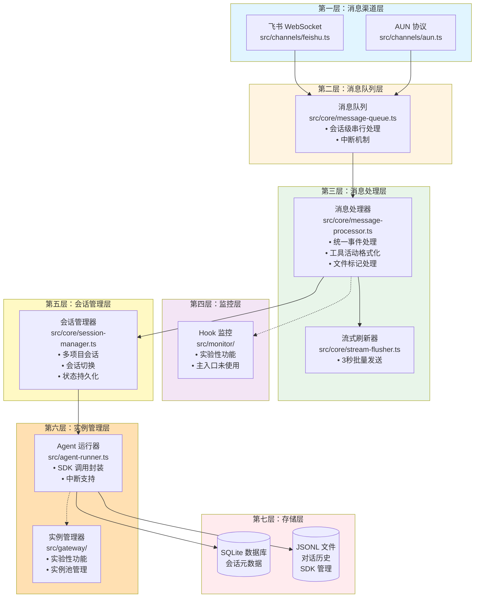

# EvolClaw 七层架构图



## 架构说明

### 数据流向

**用户消息流**：
```
用户消息 → 渠道层 → 消息队列 → 消息处理器 → 会话管理 → Agent运行器 → Claude SDK
```

**响应流**：
```
Claude SDK → Agent运行器 → 流式刷新器 → 消息处理器 → 渠道层 → 用户
```

### 关键特性

1. **中断机制**：新消息到达时，队列层立即触发中断，终止当前任务
2. **批量发送**：流式刷新器在 3 秒窗口内累积工具活动，减少消息数量
3. **统一处理**：消息处理器消除了 ~250 行重复代码，所有渠道共享同一处理逻辑
4. **会话隔离**：每个项目独立会话，切换项目时保留历史
5. **实验性层**：监控层和实例管理层保留用于参考，主入口使用简化架构

### 入口点

- **主入口** (`src/index.ts`)：生产使用，完整功能
- **网关模式** (`src/index-gateway.ts`)：实验性，保留用于参考
