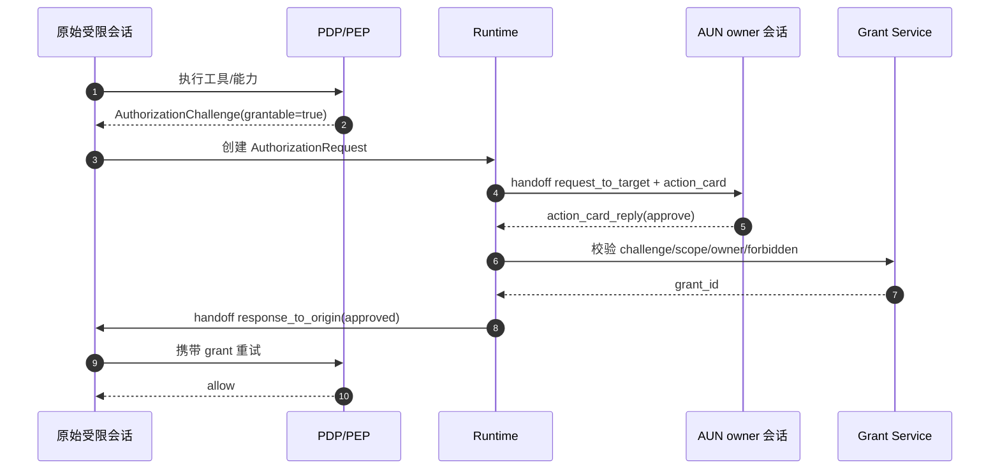

# 跨会话授权审批方案

> 状态：已实现（2026-07-13）
> 日期：2026-07-10
> 范围：特定权限模式产生真实授权 challenge 后，按审批策略在本会话审批或通过跨会话 handoff 投递给 agent owner
>
> 实现落点：`src/core/permission.ts`（显式 `AuthorizationChallenge`、`ApprovalRoute` planner、"临时授权申请" action_card、TTL）、`src/core/message/response-engine.ts`（`approvalRouting` 权威上下文）、`src/core/handoff/runtime.ts`（`request_to_target`/`response_to_origin`）。测试：`tests/unit/cross-session-permission.test.ts`。
> 关联文档：
> - `docs/msg-send-cross-session-handoff-append-only-design.md`
> - `docs/aun-message-log-msgtype-expansion-design.md`

## 1. 背景

当前权限请求主要发生在同一会话内：agent 调用工具时被权限系统拦截，系统向当前会话对端发送权限请求卡片或文本，等待对端通过按钮或 `/perm` 命令回答。

但有些会话的有效权限模式会要求人工审批，审批主体又不一定是当前会话对端。例如 admin 的内置权限模式为 `request`，工具调用产生 challenge 后，审批策略可能要求由 agent owner 决定。

- 读取或修改 owner 允许范围内的工作区文件。
- 发送由 agent 生成的文件。
- 调用某个需要 owner 临时放行的工具。
- 在只读或受限会话中执行一次受控写入。

这时不能先向请求者展示审批卡片、再判断是否转发，也不能把 grant 自动继承到其它会话。正确模型是：**只创建一个 AuthorizationRequest，先依据 challenge 的 `approver_policy` 解析审批主体，再选择本会话或跨会话投递；审批结果始终解除原始 challenge**。

## 2. 设计目标

1. **只传递审批卡片，不自动继承权限**：handoff 是授权申请和审批结果的传输轨道，不是 grant 传播通道。
2. **只向 AUN owner 申请**：MVP 只支持向 agent owners 中的 AUN 私聊 owner 发送审批卡片。
3. **基于真实 AuthorizationChallenge**：agent 只能在权限系统返回可申请 challenge 后发起跨会话审批。
4. **grant 是一等权限源**：审批通过后由 Grant Service 签发受限 capability grant，PDP 后续统一决策。
5. **append-only 可审计**：跨会话投递、消费、审批、回流全部追加到相关 `messages.jsonl`，不修改历史行。
6. **可中断、可超时、可幂等**：原始任务取消后审批请求失效；审批卡片超时后不能继续签发 grant；重复点击不重复生效。
7. **与 msgType 扩展兼容**：授权卡片使用 AUN `action_card`，日志语义遵循 `docs/aun-message-log-msgtype-expansion-design.md`。
8. **审批触发与投递解耦**：`permissionMode` 决定是否产生 challenge，`approver_policy` 决定谁审批，审批主体是否位于当前会话决定如何投递。

## 3. 非目标

- 不实现 grant 跨 session 自动继承。
- 不把 owner 身份代理给 agent 或原会话。
- 不支持 Feishu owner 审批；MVP 只考虑 AUN owner。
- 不支持群聊 owner 审批。
- 不支持多人审批、审批 agent、自动审批；这些留给后续版本。
- 不把 grant 权威状态存入 `messages.jsonl`。
- 不让模型在 owner 会话里解释审批按钮结果。

## 4. 核心原则

### 4.1 Handoff 传卡片，不传权限

跨会话 handoff 只承载：

- 授权申请卡片。
- 审批决定。
- 审批结果回流。
- 消费、取消、超时等审计事件。

真正可执行的临时能力由 Grant Service 签发和校验。grant 默认绑定原始受限上下文，而不是 owner 会话：

- `originSessionId`
- `originChannelKey`
- `originMessageId`
- `agentInstance`
- `challengeId`
- capability scope
- TTL / maxUses

### 4.2 禁止清单优先

如果 capability 命中禁止操作能力/资源清单，PDP 返回不可申请拒绝，不生成授权卡片。

示例：

```json
{
  "decision": "deny",
  "reason": "forbidden_by_policy",
  "grantable": false
}
```

只有 `grantable: true` 的 `AuthorizationChallenge` 才能进入跨会话审批。

### 4.3 审批结果仍需 PDP 校验

owner 点击批准不等于直接放行。系统必须再次校验：

- challenge 是否存在且未过期。
- request 是否仍处于 pending。
- owner 是否是合法 approver。
- scope 是否未超过 challenge 可授权边界。
- 是否未命中禁止清单。
- TTL / maxUses / binding 是否符合策略。

校验通过后才签发 grant。

### 4.4 Challenge 驱动审批路由

跨会话审批不根据 `owner/admin/member/visitor` 等角色名称直接分流。完整链路是：

```text
role / relation config
  -> effectivePermissionMode
  -> runner/PDP 产生 AuthorizationChallenge
  -> ApproverResolver 解析审批主体
  -> ApprovalDeliveryPlanner 选择 local / handoff / unavailable
```

约束如下：

- role 只参与权限模式和访问策略解析，不直接决定审批卡片投递位置。
- 只有真实工具审批回调可以创建 challenge，普通模型文本或 handoff payload 不能自报 challenge。
- 当前私聊对端恰好是合法审批主体时，使用本会话卡片。
- 审批主体不在当前私聊时，通过 handoff 投递；群聊中的 owner 也统一投递到 owner 的 AUN 私聊。
- 系统只创建一个 AuthorizationRequest，不存在先本地审批再转发的第二层审批。

## 5. 审批策略与投递路由

### 5.1 ApproverPolicy

MVP 支持：

```text
requester   -> 当前私聊对端审批
agent_owner -> agent 权威配置 owners 中的 owner 审批
```

只要 runtime 能解析 owning agent，真实工具 challenge 默认使用 `agent_owner`。完全没有 owning agent/runtime 路由上下文的独立 `PermissionGateway` 调用，兼容回退为 `requester`。

一旦策略为 `agent_owner`，未配置 owner 或 owner AUN 通道不可达时必须返回 `unavailable`，不得降级为请求者自审。

### 5.2 ApproverResolver

`agent_owner` 的 owner 列表只能由 runtime 从 agent 权威配置注入，不能信任消息 payload。MVP：

1. 从 `owners` 中选择首个可作为 AUN AID 的 owner。
2. 使用当前 agent 的 AUN interaction adapter 投递私聊卡片。
3. 没有合法 owner 时返回 `no_agent_owner_configured`。
4. owner 通道不可达时返回 `owner_approval_channel_unavailable`。

第一版不广播给所有 owners。广播会引入重复审批、竞态、生效顺序和撤销语义。后续可以扩展为：

- `fanout_first_valid_wins`
- `quorum_m_of_n`
- `security_owner_required`
- `delegated_approver_agent`

### 5.3 ApprovalDeliveryPlanner

```text
challenge.grantable = false                 -> unavailable
approver_policy = requester                 -> local
agent_owner + 当前私聊对端属于 owners       -> local
agent_owner + owner 可通过 AUN private 触达 -> handoff
其它情况                                    -> unavailable
```

这里比较的是审批人 identity 与当前会话对端 identity，而不是角色名称。admin 产生 owner challenge 时会投递给 owner；owner 在自己的私聊中产生同类 challenge 时留在当前会话。

### 5.4 与 permissionMode 的关系

`permissionMode` 只决定 runner 是否产生 challenge：

| permissionMode | 常规行为 | 产生 challenge 后 |
|---|---|---|
| `request` | SDK/PDP 请求人工确认 | 按 `approver_policy` 路由 |
| `bypass` | 普通操作直通；强制危险规则仍可挑战 | 按 `approver_policy` 路由 |
| `auto` | 自动决策 | 仅独立规则产生 challenge 时路由 |
| `readonly` | 越界操作硬拒绝 | 默认不产生 challenge |
| `noask` | 拒绝 | 不产生 challenge |

因此 admin 的 `permissionMode=request` 会产生 challenge，并在 `agent_owner` 策略下直接投递 owner；owner 的 `permissionMode=bypass` 仅在强制危险规则产生 challenge 时进入审批。

## 6. 端到端流程

### 6.1 正常批准流程



### 6.2 拒绝流程

owner 点击拒绝后：

1. 授权请求状态改为 `denied`。
2. 不签发 grant。
3. 向原会话回流 `authorization_decision: denied`。
4. 原任务按权限拒绝处理。

### 6.3 取消流程

原始受限任务被中断或取消后：

1. 授权请求状态改为 `cancelled`。
2. 原等待 promise 以 deny/cancel 结束。
3. owner 卡片后续点击时返回“申请已取消”。
4. 追加 append-only 状态事件。
5. 不签发 grant。

owner 会话自身被打断不取消申请。owner 卡片是系统交互入口，不依赖 owner 会话中的模型任务继续运行。

### 6.4 超时流程

审批请求有独立超时：

- `approval_request_ttl`：授权卡片可审批时长，建议默认 20 分钟。
- `grant_ttl`：批准后 grant 有效时长，由 owner 或策略选择，建议默认 10-30 分钟。

超过 `approval_request_ttl` 后：

1. 授权请求状态改为 `expired`。
2. 原等待任务按 deny/timeout 处理。
3. owner 晚到点击返回“申请已过期”。
4. 不签发 grant。

## 7. 与当前单会话权限请求的关系

当前单会话权限请求已有以下机制：

- `PermissionGateway.requestPermission()` 创建 `requestId` 并发送 `ActionInteraction`。
- `InteractionRouter` 关联卡片回复和 request id。
- `/perm allow|always|deny` 可作为文本 fallback。
- `PermissionGateway.resolvePermission()` 解除 pending。
- `PermissionGateway.cancelAll(sessionId)` 可取消某会话 pending 请求。
- `InteractionRouter` 支持 timeout，但当前权限请求没有传业务 timeout。

本会话审批和跨会话审批共用同一个 AuthorizationRequest，只是 delivery route 不同。`PermissionGateway.requestPermission()` 表示 runner/PDP 已产生真实 challenge，随后统一执行：

```text
AuthorizationChallenge
  -> planApprovalRoute()
  -> local | handoff | unavailable
```

跨会话路径在复用现有抽象的基础上补齐两个点：

1. `task:interrupted` 时应调用授权请求管理器取消原始 session 的 pending cross-session auth request。
2. cross-session auth request 必须有 `approval_request_ttl`，不能无限等待 owner。

单会话 `/perm always` 表示始终允许某工具；跨会话不提供 `always`，只提供“批准本次”和严格绑定原 session、工具、完整输入指纹的“本会话 30 分钟”。

## 8. 复用 handoff 的设计

复用 `docs/msg-send-cross-session-handoff-append-only-design.md` 中的以下设计：

- `request_to_target`：原会话向 owner AUN 会话投递授权卡片。
- `response_to_origin`：审批结果回流原会话。
- `handoff_state`：表达 consumed/cancelled/expired/decided 等状态事件。
- `messages.jsonl` append-only：不新增记录文件，不修改历史 JSONL 行。
- `ref_message_id` / `card_message_id`：作为精确关联键。
- 多候选无精确引用时不自动归属。
- `TaskRuntimeContext`：保存来源 session/message/channel/peer 信息，确保回流到正确原会话。

不复用：

- 不要求 owner 模型调用 `ec handoff return`。
- 不把审批结果作为普通 agent 输入让模型解释。
- 不用 handoff 存 grant 的权威状态。
- 不让 `handoff.kind` 表达授权业务类型；授权语义放在 `auth` metadata 中。

## 9. 数据模型

### 9.1 AuthorizationChallenge

Runtime 显式模型：

```ts
type ApproverPolicy = 'requester' | 'agent_owner';

interface AuthorizationChallenge {
  id: string;
  sessionId: string;
  toolName: string;
  toolInput: Record<string, unknown>;
  summary: string;
  reason?: string;
  grantable: boolean;
  approverPolicy: ApproverPolicy;
  createdAt: number;
}

type ApprovalRoute =
  | { kind: 'local'; approverId: string }
  | { kind: 'handoff'; approverId: string; channel: 'aun'; adapter: ChannelAdapter }
  | { kind: 'unavailable'; reason: string };

interface ApprovalRoutingContext {
  approverPolicy: ApproverPolicy;
  owners: string[];
  ownerAdapter?: ChannelAdapter;
  selfAid?: string;
  originSessionId: string;
  originMessageId?: string;
  originChannel?: string;
  originChannelId?: string;
  originPeerId?: string;
  originRole?: string;
  approvalTtlMs?: number;
}
```

PDP 协议中的可申请 challenge 示例：

```jsonc
{
  "challenge_id": "ch_123",
  "decision": "deny",
  "reason": "missing_capability",
  "grantable": true,
  "required_capabilities": [
    {
      "namespace": "workspace.file",
      "action": "write",
      "resource_selector": {
        "type": "path_glob",
        "value": "/project/src/**"
      }
    }
  ],
  "grant_options": {
    "approver_policy": "agent_owner",
    "ttl_options_seconds": [600, 1800, 3600],
    "max_use_options": [1, 3, 10],
    "bindable": ["session", "channelKey", "agentInstance"]
  },
  "risk": {
    "level": "medium",
    "factors": ["write_access", "non_owner_origin"]
  }
}
```

### 9.2 授权卡片投递日志

投递给 owner 的 AUN payload 使用 `action_card`。根据 `docs/aun-message-log-msgtype-expansion-design.md`，日志应写 `msgType: "action_card"`。在 msgType 扩展未完成前，可兼容旧实现写 `msgType: "text"`，但必须保留 `handoff.auth` metadata 供 replay。

```jsonc
{
  "ts": 1783670400000,
  "time": "2026-07-10 12:00:00.000",
  "dir": "out",
  "from": "self.agentid.pub",
  "to": "owner.agentid.pub",
  "chatType": "private",
  "groupId": null,
  "msgId": "auth-card:authreq_123",
  "msgType": "action_card",
  "payloadType": "action_card",
  "content": "[card] 临时授权申请",
  "replyTo": null,
  "agent": null,
  "model": null,
  "permMode": null,
  "cmdParsed": null,
  "durationMs": null,
  "source": "handoff",
  "handoff": {
    "kind": "request_to_target",
    "origin": {
      "session_id": "meta_origin_xxx",
      "message_id": "origin_msg_xxx",
      "channel": "aun",
      "peerId": "requester.agentid.pub",
      "threadId": "origin-thread-id",
      "peerName": "Requester",
      "peerType": "human",
      "role": "guest"
    },
    "auth": {
      "kind": "authorization_request",
      "request_id": "authreq_123",
      "challenge_id": "ch_123",
      "approver_policy": "agent_owner",
      "approval_request_expires_at": "2026-07-10T12:20:00+08:00",
      "requested_capabilities": [
        {
          "namespace": "workspace.file",
          "action": "write",
          "resource_selector": {
            "type": "path_glob",
            "value": "/project/src/**"
          }
        }
      ],
      "reason": "需要修改源文件以完成当前任务",
      "expected_actions": ["edit files under /project/src"],
      "risk": {
        "level": "medium",
        "factors": ["write_access", "non_owner_origin"]
      },
      "constraints_options": {
        "grants": [
          { "action": "approve_once", "max_uses": 1, "binding": ["challenge"] },
          { "action": "approve_session_30m", "ttl_seconds": 1800, "binding": ["session", "tool", "input"] }
        ]
      }
    }
  }
}
```

### 9.3 AUN action_card payload

```jsonc
{
  "type": "action_card",
  "title": "临时授权申请",
  "format": "markdown",
  "text": "**申请信息**\n\n- **申请主体**：`requester.agentid.pub` · role `admin` · via `aun`\n\n**请求执行**\n\n- **申请能力**：`tool:Write`\n- **申请原因**：需要修改源文件以完成当前任务\n\n**目标 / 参数**\n\n```text\n/project/src/file.ts\n```\n\n**风险与有效期**\n\n- **风险：中** · 请核对目标和参数",
  "actions": [
    {
      "label": "批准本次",
      "value": "approve_once",
      "style": "primary",
      "behavior": "reply"
    },
    {
      "label": "本会话 30 分钟",
      "value": "approve_session_30m",
      "style": "default",
      "behavior": "reply"
    },
    {
      "label": "拒绝",
      "value": "deny",
      "style": "danger",
      "behavior": "reply"
    }
  ],
  "ref_message_id": "origin_msg_xxx"
}
```

当前实现提供：

- `approve_once`：只解除当前 pending challenge，最多执行一次。
- `approve_session_30m`：进程内临时授权 30 分钟，严格绑定原 session、工具名和完整输入指纹；参数变化、跨 session 或进程重启后失效。
- `deny`：拒绝当前 challenge。

后续在通用 Grant Service 落地后可增加：

- `adjust_scope`
- `approve_10m`
- 可配置 TTL / maxUses / binding
- `approve_once_readonly`

### 9.4 审批决定事件

owner 点击后，AUN 入站收到 `action_card_reply`。该消息不进入模型，而由系统回调处理。处理后在 owner chat 追加 decision 状态事件。

```jsonc
{
  "ts": 1783670460000,
  "time": "2026-07-10 12:01:00.000",
  "dir": "out",
  "from": "self.agentid.pub",
  "to": "owner.agentid.pub",
  "chatType": "private",
  "groupId": null,
  "msgId": "auth-decision:authreq_123:approve_once",
  "msgType": "handoff_state",
  "content": "",
  "replyTo": "auth-card:authreq_123",
  "source": "handoff",
  "handoff": {
    "event": "decided",
    "consumed_by_msg_id": "owner_reply_msg_456",
    "auth": {
      "kind": "authorization_decision",
      "request_id": "authreq_123",
      "challenge_id": "ch_123",
      "decision": "approved",
      "action": "approve_once",
      "operator_aid": "owner.agentid.pub",
      "grant_id": "grant_789"
    }
  }
}
```

若审批被拒绝：

```jsonc
{
  "msgType": "handoff_state",
  "replyTo": "auth-card:authreq_123",
  "source": "handoff",
  "handoff": {
    "event": "decided",
    "auth": {
      "kind": "authorization_decision",
      "request_id": "authreq_123",
      "decision": "denied",
      "operator_aid": "owner.agentid.pub"
    }
  }
}
```

### 9.5 回流到原会话

审批完成后，daemon 在来源会话追加 `handoff_result`：

```jsonc
{
  "ts": 1783670461000,
  "time": "2026-07-10 12:01:01.000",
  "dir": "out",
  "from": "self.agentid.pub",
  "to": "origin-channel-id",
  "chatType": "private",
  "groupId": null,
  "msgId": "auth-return:authreq_123",
  "msgType": "handoff_result",
  "content": "owner 已批准临时授权，grant=grant_789",
  "replyTo": "origin_msg_xxx",
  "source": "handoff",
  "handoff": {
    "kind": "response_to_origin",
    "request_content": "workspace.file.write /project/src/**",
    "origin": {
      "session_id": "owner_session_xxx",
      "message_id": "owner_reply_msg_456",
      "channel": "aun",
      "peerId": "owner.agentid.pub",
      "peerName": "Owner",
      "peerType": "human",
      "role": "owner"
    },
    "auth": {
      "kind": "authorization_result",
      "request_id": "authreq_123",
      "challenge_id": "ch_123",
      "decision": "approved",
      "grant_id": "grant_789",
      "expires_at": "2026-07-10T12:31:01+08:00",
      "max_uses": 1
    }
  }
}
```

原会话收到回流后，不应直接认为工具已经执行成功。它应携带 grant 重新触发原工具调用或唤醒等待中的执行流程。

## 10. 状态机

授权请求状态：

```text
created
  -> delivered
  -> pending
  -> approved -> issued -> returned -> consumed
  -> denied -> returned -> consumed
  -> cancelled
  -> expired
  -> failed
```

状态说明：

- `created`：基于真实 challenge 创建申请。
- `delivered`：授权卡片已发送到 owner AUN 会话。
- `pending`：等待 owner 点击。
- `approved`：owner 选择批准，但 grant 尚未签发或尚未回流。
- `issued`：Grant Service 已签发 grant。
- `returned`：审批结果已写入来源会话并入队。
- `consumed`：来源会话已消费审批结果。
- `denied`：owner 拒绝。
- `cancelled`：原始任务取消或中断。
- `expired`：超过审批 TTL。
- `failed`：投递、校验或签发失败。

`messages.jsonl` 是审计事实源之一，但状态权威建议由 AuthRequest manager / Grant Service 维护。日志 replay 用于调试、恢复和追责，不作为 grant 有效性的唯一依据。

## 11. 中断设计

### 11.1 当前单会话问题

当前单会话权限 pending 有 `PermissionGateway.cancelAll(sessionId)`，但权限请求没有业务超时，且 task interrupt 主要中断 runner。跨会话审批如果沿用无限等待，会导致：

- owner 离线时原任务长期挂起。
- 原任务已被新消息中断后，owner 晚到批准仍可能产生无意义 grant。
- 卡片回调和原始执行上下文脱节。

### 11.2 跨会话处理规则

原始 session 出现以下事件时取消 pending 跨会话授权：

- 新消息打断当前任务。
- 用户显式 `/stop` 或等价 interrupt。
- 原始消息撤回。
- agent runner abort。
- session 被关闭或切换导致任务不可恢复。

取消动作：

1. AuthRequest manager 标记 `cancelled`。
2. 原等待 promise 结束，行为等价 deny，但原因是 `cancelled`。
3. 追加 `handoff_state` 取消事件。
4. Grant Service 不签发 grant。
5. owner 晚到点击时返回“申请已取消”。

owner 会话的普通消息或 interrupt 不影响申请。只有审批卡片本身的 action_card_reply 才能推进状态。

## 12. 超时设计

MVP 建议默认：

```text
approval_request_ttl = 20m
approve_once = 当前 challenge，最多 1 次
approve_session_30m = 30m，绑定 session + tool + 完整 input 指纹
```

当前 30 分钟 grant 保存在 `PermissionGateway` 内存中，不跨 daemon 重启持久化；参数变化、跨 session 或到期后必须重新审批。通用 TTL、maxUses 和 binding 配置留给后续 Grant Service。

超时实现要求：

- AuthRequest manager 创建定时器或由周期任务扫描 pending 请求。
- 超时后追加 `handoff_state` expired 事件。
- 超时不删除 owner 卡片日志。
- 晚到 action_card_reply 必须拒绝，不能复活请求。
- 原始任务等待时应收到 `deny` 或更明确的 `timeout` 结果。

如果底层仍复用 `PermissionGateway` 的三态返回，第一版可把 timeout 映射为 `deny`，但事件和日志中保留 `reason: "expired"`。

## 13. 与 AUN action_card 的关系

可以复用 AUN 的 `action_card` 和 `action_card_reply`：

- `action_card` 负责展示授权请求和按钮。
- `action_card_reply` 负责稳定回传 owner 的选择。
- `card_message_id` / `ref_message_id` 负责关联原卡片。
- channel 层消费 `action_card_reply`，不分发给 agent。

但不要把授权状态绑死在 AUN 卡片自身：

- AUN 是展示和交互承载层。
- handoff 是跨会话投递和回流层。
- AuthRequest manager 是申请状态层。
- Grant Service 是授权事实层。

这样后续可以支持 Feishu 卡片、CLI 审批、审批 agent 或多人审批，而不改授权核心协议。

## 14. messages.jsonl 复用边界

复用 `messages.jsonl` 是合适的，但只用于以下内容：

- 授权卡片已投递给哪个 owner。
- owner 做出什么决定。
- 请求是否 consumed/cancelled/expired。
- 审批结果是否回流到来源会话。
- 调试和审计所需的轻量摘要。

不适合放入：

- grant 权威状态。
- grant 使用次数的唯一计数。
- owner 身份 token。
- 密钥、完整敏感数据、完整大 payload。
- 可绕过 PDP 的执行凭据。

按照 `docs/aun-message-log-msgtype-expansion-design.md`，授权卡片应尽量记录为：

```jsonc
{
  "msgType": "action_card",
  "payloadType": "action_card",
  "content": "[card] 临时授权申请",
  "handoff": {
    "kind": "request_to_target",
    "auth": {}
  }
}
```

如果 msgType 扩展尚未落地，旧实现可能仍写 `msgType: "text"`。授权 replay 不应依赖 `msgType` 判断，而应依赖：

- `source`
- `handoff.kind`
- `handoff.auth.kind`
- `msgId`
- `replyTo`

## 15. 权限与安全边界

### 15.1 审批者身份

owner 点击卡片时，只信 AUN 认证信封中的 sender AID，不信 payload 自报字段。

校验：

- sender AID 在 agent owners 中。
- sender AID 等于本次 request 选定 approver，或符合 approver policy。
- owner 会话是 AUN private。

### 15.2 Scope 约束

owner 可以：

- 批准默认最小 scope。
- 选择更短 TTL。
- 降低 maxUses。
- 增加 binding。
- 后续版本缩小资源范围。

owner 不可以：

- 扩大到 challenge 之外。
- 覆盖禁止清单。
- 批准长期身份代理。
- 授权其它 session 使用 grant。

### 15.3 Grant 使用

每次 grant 使用都要重新走 PEP/PDP：

- grant 未过期。
- grant 未撤销。
- maxUses 未耗尽。
- subject/session/channel/agentInstance 匹配。
- action/resource 在 scope 内。
- 当前策略未新增 explicit deny。

## 16. 实施计划

### Phase 1：核心模型

1. 定义 `AuthorizationChallenge`、`AuthorizationRequest`、`AuthorizationDecision`、`AuthorizationResult`。
2. 建立 AuthRequest manager，管理 pending/cancelled/expired 状态。
3. 定义 `handoff.auth` metadata schema。
4. 增加禁止清单检查结果，不可申请时不生成卡片。

### Phase 2：AUN owner 投递

1. 实现 AUN owner resolver。
2. 生成 `action_card` 授权卡片。
3. 通过 handoff `request_to_target` 写入 owner chat `messages.jsonl`。
4. 注册 InteractionRouter 或专用 auth callback。
5. owner 点击后处理 `action_card_reply`，不分发给 agent。

### Phase 3：审批回流与 grant

1. 校验 owner 身份和 request 状态。
2. 调用 Grant Service 签发受限 grant。
3. 追加 owner chat decision 状态事件。
4. 通过 `response_to_origin` 写入来源会话。
5. 唤醒原任务或让原会话重试原工具调用。

### Phase 4：中断与超时

1. 将原 session task interrupt 接入 AuthRequest manager。
2. 超时扫描或定时器。
3. 晚到点击返回 expired/cancelled。
4. 追加对应 append-only 状态事件。

### Phase 5：msgType 扩展对齐

1. 按 `docs/aun-message-log-msgtype-expansion-design.md` 扩展 `msgType`。
2. 授权卡片日志写 `action_card`。
3. `action_card_reply` 可审计但不进模型。
4. watch/stats/prompt 过滤状态事件和不应进入 prompt 的卡片事件。

## 17. 测试清单

必须覆盖：

- admin/member 等会话触发 `agent_owner` challenge，系统向 AUN owner 发送授权卡片。
- 当前私聊对端就是 owner 时使用本会话审批；群聊中的 owner 仍投递到 owner 私聊。
- `requester` policy 不受角色名称影响，始终在当前会话审批。
- owner 未配置或不可达时明确拒绝，不回退为请求者自审。
- 命中禁止清单时不发送卡片。
- owner 批准后签发 grant，回流原会话，原工具重试成功。
- owner 拒绝后回流拒绝，原工具不执行。
- 原任务中断后，owner 晚到点击显示已取消，不签发 grant。
- 审批超时后，owner 晚到点击显示已过期，不签发 grant。
- owner 不是本次 approver 时点击被拒绝。
- 重复点击同一卡片只生效一次。
- 30 分钟 grant 只命中同 session、同工具、同输入；跨 session、参数变化和过期后重新审批。
- daemon 重启后，可通过持久 auth request 或日志恢复 pending/expired 判断。
- `messages.jsonl` 中授权卡片、decision、result 均为 append-only。
- watch/stats/prompt 不把 `handoff_state`、授权卡片和 `action_card_reply` 当普通对话。
- `msgType` 扩展落地后，授权卡片记录为 `action_card`。

## 18. 风险与建议

### 18.1 内存态卡片关联风险

AUN 当前卡片关联可能依赖内存 map。授权审批不能只依赖内存 map；必须有持久 `request_id/challenge_id`，并能在 daemon 重启后判断卡片是否仍可处理。

### 18.2 日志与授权状态混淆

`messages.jsonl` 是审计和跨会话投递事实源，不是 grant 状态库。Grant Service 必须独立维护 grant 有效性、撤销和使用次数。

### 18.3 超时语义与单会话不一致

单会话权限请求当前没有业务 timeout。跨会话必须加 timeout，因为 owner 可能离线。第一版可以只对跨会话请求启用，不影响单会话行为。

### 18.4 多 owner 竞态

MVP 选择单 owner，避免竞态。后续如做 fanout，需要增加 request version、first-valid-wins、decision conflict audit 和卡片终态更新。

## 19. 结论

跨会话授权审批应实现为：

```text
AuthorizationChallenge
  -> ApproverResolver
  -> ApprovalDeliveryPlanner(local | handoff | unavailable)
  -> AUN owner action_card via handoff request_to_target（handoff 路由）
  -> action_card_reply system callback
  -> Grant Service issue/deny
  -> handoff response_to_origin
  -> origin session retries with grant
```

这条链路不会自动继承权限，也不会把 owner 身份交给 agent。`permissionMode` 负责产生 challenge，`approver_policy` 负责确定审批主体，delivery planner 负责选择投递位置。handoff 只负责跨会话传递授权卡片和审批结果；当前最小 grant 严格绑定原 session、工具和输入，后续由通用 Grant Service 承担完整生命周期。
