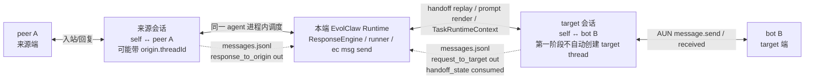
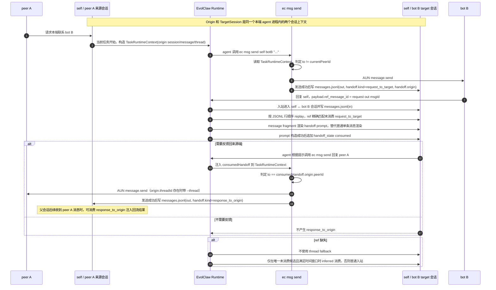

# msg send 跨会话 handoff 追加式设计

> 状态：已实现
> 最后更新：2026-07-09
> 范围：AUN 私聊 `ec msg send` 触发的跨会话上下文传递
> 约束：不新增记录文件；不修改历史 JSONL 行；不新增查询命令

## 1. 背景

某个 EvolClaw 会话可以通过 `ec msg send` 主动联系另一个 AID。target 后续回复时，消息进入的是“本端 agent 与 target”的 AUN 会话，而不是发起 `msg send` 的原会话。

本方案解决三个问题：

1. target 会话处理回复时，需要知道本端此前通过 `msg send` 发过什么。
2. 原会话不通过查询命令拿结果，而由子会话必要时通过 `msg send` 回到原会话。
3. 多个 requester 同时让本端联系同一个 target 时，不能因为 target 相同而串话。

## 2. 设计原则

1. **不新增记录文件**：跨会话状态全部落在对应 chat 的 `messages.jsonl`。
2. **append-only**：不重写旧 JSONL 行；消费状态通过追加状态事件表达。
3. **精确引用优先**：target 回复 payload 中的 `ref_message_id` 是消费主键。
4. **保守降级**：没有 `ref_message_id` 且存在多条候选时，不自动消费，避免串话。
5. **普通消息格式对齐**：handoff 状态事件也必须包含 `ts/time/dir/from/to/chatType/msgId/msgType/content/...` 等标准字段。
6. **用 `msgType` 区分状态事件**：不引入 `localOnly`；所有消费者通过 `msgType === "handoff_state"` 判断并过滤。

## 3. 数据模型

### 3.1 request_to_target 出站消息

父会话通过 `ec msg send` 联系 target 后，在 `self ↔ target` 的 `messages.jsonl` 写正常 out 消息，并附加 `handoff` 元数据。

```jsonc
{
  "ts": 1783340004000,
  "time": "2026-07-07 20:00:04.000",
  "dir": "out",
  "from": "self.agentid.pub",
  "to": "target.agentid.pub",
  "chatType": "private",
  "groupId": null,
  "msgId": "msg_to_target_123",
  "msgType": "text",
  "content": "请确认这个接口设计是否合理",
  "replyTo": null,
  "agent": null,
  "model": null,
  "permMode": null,
  "cmdParsed": null,
  "durationMs": null,
  "source": "msg",
  "handoff": {
    "kind": "request_to_target",
    "origin": {
      "session_id": "meta_parent_xxx",
      "message_id": "parent_msg_xxx",
      "channel": "aun",
      "peerId": "alice.agentid.pub",
      "threadId": "parent-thread-id",
      "peerName": "Alice",
      "peerType": "human",
      "role": "owner"
    }
  }
}
```

说明：

- `handoff.kind` 表示跨会话链路用途，不与顶层 `source: "msg"` 混用。
- `handoff.origin.session_id` 是发起 `msg send` 的父会话 session id。
- `handoff.origin.message_id` 是触发本次 `msg send` 的父会话消息 id。
- `handoff.origin.threadId` 是来源会话 thread；来源会话无 thread 时可省略。
- `handoff.origin.channel/peerName/peerType/role` 用于子会话注入提示词展示来源端信息。
- `request_to_target` 的标记目的，是让 target 后续回复进入 `self ↔ target` 会话时，系统能从被回复的 out
  消息反查“这是谁让本端发出的请求、结果应回到哪里”。没有这个标记，`ref_message_id` 只能指向一条本端
  out 消息，不能恢复来源会话。
- 初始 out 行不写 `consumed`。是否已消费由后续 `handoff_state` 事件 replay 得出。

### 3.2 consumed 状态事件

target 回复被成功注入子会话 prompt 后，追加一条状态事件，不修改原 out 行。

```jsonc
{
  "ts": 1783340799000,
  "time": "2026-07-07 20:13:19.000",
  "dir": "out",
  "from": "self.agentid.pub",
  "to": "target.agentid.pub",
  "chatType": "private",
  "groupId": null,
  "msgId": "handoff-consumed:msg_to_target_123:target_reply_456",
  "msgType": "handoff_state",
  "content": "",
  "replyTo": "msg_to_target_123",
  "agent": null,
  "model": null,
  "permMode": null,
  "cmdParsed": null,
  "durationMs": null,
  "source": "msg",
  "handoff": {
    "event": "consumed",
    "consumed_by_msg_id": "target_reply_456"
  }
}
```

字段说明：

- `ts/time`：必须有，用于展示和调试；replay 以 JSONL 文件行顺序为准。
- `dir: "out"`：状态事件由本端产生；但消费者不能把它当真实出站消息。
- `msgId`：状态事件自己的确定性 ID。重复追加同一事件时可按 `msgId` 去重。
- `msgType: "handoff_state"`：区分普通消息和状态事件的主判断字段。
- `content: ""`：对齐 schema，避免污染聊天文本。
- `replyTo`：复用现有字段，指向被消费的原始 `msg send` 出站消息。
- `source: "msg"`：表示事件属于 `ec msg send` 跨会话链路。
- `handoff.event: "consumed"`：事件类型。
- `handoff.consumed_by_msg_id`：是哪条 target 回复触发了消费。

不设置 `handoff.consumed`，因为 `event: "consumed"` 已表达同一语义。

### 3.3 response_to_origin 出站消息

子会话处理 target 回复后，如果需要回到原会话，通过 `ec msg send` 发给来源端。该 out 消息写入 `self ↔ sourcePeer` 的 `messages.jsonl`。

```jsonc
{
  "ts": 1783341000000,
  "time": "2026-07-07 20:16:40.000",
  "dir": "out",
  "from": "self.agentid.pub",
  "to": "alice.agentid.pub",
  "chatType": "private",
  "groupId": null,
  "msgId": "msg_to_origin_789",
  "msgType": "text",
  "content": "target 的回复是：...",
  "replyTo": null,
  "agent": null,
  "model": null,
  "permMode": null,
  "cmdParsed": null,
  "durationMs": null,
  "source": "msg",
  "handoff": {
    "kind": "response_to_origin",
    "origin": {
      "session_id": "meta_child_xxx",
      "message_id": "target_reply_456",
      "channel": "aun",
      "peerId": "target.agentid.pub",
      "peerName": "Target",
      "peerType": "agent",
      "role": "guest"
    }
  }
}
```

父会话后续收到来源端消息时，可以消费这条 `response_to_origin`，把子会话回流结果注入当前父会话 prompt。
`response_to_origin` 必须写 handoff，因为这条子会话返回消息对父会话同样是“缺失上下文”；没有该标记，
父会话无法知道这条 out 消息是哪个 target 会话回流的结果。父会话注入提示词不能再次要求“回复原会话”。

### 3.4 运行时 handoff 上下文

`ec msg send` 在 agent 任务中运行时，不能只依赖 `EVOLCLAW_SESSION_ID`。写出 `handoff.origin`
至少还需要本轮入站消息 ID 和当前对端信息。

要求 ResponseEngine / runner 在本轮任务的 shell 环境或等价内部参数中提供一份 TaskRuntimeContext：

- 当前 EvolClaw session id。
- 当前入站 message id。
- 当前 channel / peerId / peerName / peerType / role / threadId。
- 被回流来源会话的 channel / peer AID / threadId（若存在）。第一阶段只使用来源会话 thread，用于回到来源端；
  不自动创建 target thread。
- 如果本轮消息已经消费了一个 handoff，则提供被消费的 handoff 上下文，用于后续 `ec msg send` 回到来源端时写
  `handoff.kind: "response_to_origin"`。

TaskRuntimeContext 的用途是让独立执行的 `ec msg send` CLI 知道“当前发送属于哪一轮任务、当前对端是谁、
本轮是否消费了 handoff”。它只用于本轮发送判定和落盘，不是新的记录文件，也不能通过扫描最近消息临时推断。

示例：

```jsonc
{
  "taskId": "task-xxx",
  "sessionId": "meta_parent_xxx",
  "messageId": "parent_msg_xxx",
  "channel": "aun",
  "chatType": "private",
  "selfAid": "self.agentid.pub",
  "peerId": "alice.agentid.pub",
  "peerName": "Alice",
  "peerType": "human",
  "peerRole": "owner",
  "threadId": "parent-thread-id",
  "consumedHandoff": null
}
```

`ec msg send` 发送成功后按以下优先级决定是否写 `handoff`：

1. 如果本轮消费了 `request_to_target`，且发送目标 `to === consumedHandoff.origin.peerId`，写
   `response_to_origin`。
2. 否则，如果这是 agent 任务中的 AUN 私聊发送，且发送目标 `to !== currentPeerId`，写 `request_to_target`。
3. 否则，手动 CLI 发送、缺少当前任务 message id、或只是发送给当前会话对端本身的普通回复，不写 handoff。

不要通过 `--thread` 是否存在推断 handoff 语义；`--thread` 只表示目标会话话题路由。
第一阶段不自动为 target 生成 thread，也不使用 target thread 做 handoff fallback。

## 4. 三端双会话与运行时时序图

本方案涉及三个通信端和本端内部两个会话：

- 来源端 peer A：发起“请联系 target”的用户或 agent。
- 本端 EvolClaw agent：同一个 agent 进程，内部有来源会话和 target 会话两个上下文。
- target 端 bot B：被 `ec msg send` 联系的 AUN 私聊对端。

本端内部两个会话：

- 来源会话：`self ↔ peer A`。它可能是主会话，也可能是来源 thread 会话。
- target 会话：`self ↔ bot B`。第一阶段不自动创建 target thread，target 回复默认进入 `self ↔ bot B` 主会话。

### 4.1 三端双会话结构图



### 4.2 运行时时序图



关键边界：

- target 会话第一阶段不自动建 thread；`origin.threadId` 只用于回到来源会话。
- `request_to_target` 和 `response_to_origin` 都写在各自实际发送目标的 chat `messages.jsonl` 中。
- `handoff_state consumed` 只写在被消费的 request/response 所在 chat 中，不发送给对端。
- TaskRuntimeContext 是运行时传递给 CLI 的当前任务上下文，不是持久化记录。

## 5. 消费 replay 规则

读取某个 chat 的 `messages.jsonl` 时：

1. 按 JSONL 文件行顺序读取所有行；`ts/time` 只用于展示和调试，不作为 replay 排序依据。
2. 普通 handoff 出站候选：
   - `dir === "out"`
   - `source === "msg"`
   - `msgType !== "handoff_state"`
   - `handoff.kind` 为 `request_to_target` 或 `response_to_origin`
3. consumed 状态事件：
   - `msgType === "handoff_state"`
   - `handoff.event === "consumed"`
   - `replyTo` 指向某条 handoff 出站消息的 `msgId`
4. 如果某条 handoff 出站消息存在对应 consumed 事件，则 replay 后视为已消费。
5. 如果不存在 consumed 事件，则视为未消费。

重复 consumed 事件按 `msgId` 去重；即使重复写入，也不改变最终状态。

## 6. target 回复消费流程

target 回复进入 `self ↔ target` 会话时，处理顺序如下：

1. 从 inbound payload 读取 `ref_message_id`。
2. 在当前 chat 的 `messages.jsonl` 中查找 `msgId === ref_message_id` 的未消费 `request_to_target` 出站消息。
3. 找到唯一匹配后，将该出站消息内容注入到 target 回复前面。
4. prompt 构造成功后，追加 `handoff_state consumed` 事件。
5. 若无 `ref_message_id`，进入降级逻辑。

降级逻辑：

1. 第一阶段不使用 `thread_id` 做 fallback；来源会话 thread 只用于回到来源端，不用于匹配 target 回复。
2. 如果没有 `ref_message_id`，且当前 chat 只有一条未消费 `request_to_target`，该候选早于当前 inbound，
   且未超过实现定义的最大关联窗口，可保守消费。
3. 无 `ref_message_id` 的保守消费必须写日志标记为 inferred，不在 prompt 中额外提示。
4. 如果有多条未消费候选，不自动消费，不注入候选内容，避免串话。

## 7. prompt 注入方式

handoff prompt 注入采用 ECK 的 **message 层 vars + manifest** 机制，不直接拼进长期 system prompt。

### 7.1 system prompt 与 message prompt 分工

不建议把具体 handoff 内容拆进 system prompt。分工如下：

- **system prompt**：只放稳定、跨 turn 不变的通用规则。第一阶段可以不新增；若后续需要，也只能描述
  “跨会话上下文块是本轮一次性上下文，按其中给出的 AID/thread/命令处理”，不能包含具体来源 AID、threadId、
  原请求内容或回流内容。
- **message prompt**：放本轮 handoff 的全部动态信息，包括 handoff kind、来源 channel、来源 AID、来源 threadId、
  来源名称/身份、此前发给当前对端的内容、回流内容、以及本轮可执行的 `ec msg send` 命令。

原因：

1. handoff 是 per-message 状态，放入 system prompt 会污染后续 turn，并破坏 prompt cache 稳定性。
2. system prompt 是会话级语义，不能承载某一次 `msg send` 的来源端事实。
3. message-renderer 本来就是逐条入站消息渲染，适合承载一次性 handoff 上下文。

实现要求：

1. handoff replay 在当前 chat 的 `messages.jsonl` 中计算出本轮可消费的 handoff。
2. 将 handoff 上下文作为 message-renderer 的临时 vars，或作为一种合成 `SubMessage` 放在当前对端消息前。
3. 由 message manifest / message fragment 渲染最终提示词正文。
4. 渲染出的 handoff 提示只进入本轮 user prompt；不写入 persona、working memory 或 system prompt。
5. `handoff_state` 状态事件不得作为普通消息 item 进入 message-renderer。
6. 如果提示中要求模型可通过 `ec msg send` 回流结果，必须展示可路由的 AID 和完整命令格式；只展示 `peerName`
   不足以可靠发送。
7. 如果来源会话有 thread，来源信息必须展示该 threadId，且回复命令必须带 `--thread`；如果没有 thread，则只渲染
   不带 `--thread` 的命令。这个分支由 vars + manifest 条件选择，最终提示词里只出现一种命令。
8. handoff fragment 包含“当前对端回复内容”时，必须替代普通单条消息渲染，不能再让当前入站消息被普通
   message fragment 额外渲染一次。

下面两节的文本是 message fragment 的语义模板，不是硬编码拼接点。

## 8. 子会话注入提示词

子会话注入面向 target 回复。提示词不展示 session id 和 message id，但必须展示来源端 AID 和必要的 thread
路由信息，使模型能够直接构造 `ec msg send`。

message fragment 根据 `handoff.origin.threadId` 是否存在选择下面两个模板之一，最终只渲染一个。

无来源 thread 时：

```text
[跨会话请求上下文，仅本端可见]

说明：
- 这条消息是当前对端对本端此前主动 `ec msg send` 的回复。
- 请结合下方“此前发给当前对端的内容”和“当前对端回复内容”理解当前回复。
- 需要把结果反馈给来源端时，使用：`ec msg send self.agentid.pub alice.agentid.pub "<反馈内容>"`

来源：
- 来源渠道：aun
- 来源 AID：alice.agentid.pub
- 来源名称：Alice
- 来源身份：human / owner

此前发给当前对端的内容：
请确认这个接口设计是否合理

当前对端回复内容：
这里渲染当前入站消息正文。
```

有来源 thread 时：

```text
[跨会话请求上下文，仅本端可见]

说明：
- 这条消息是当前对端对本端此前主动 `ec msg send` 的回复。
- 请结合下方“此前发给当前对端的内容”和“当前对端回复内容”理解当前回复。
- 需要把结果反馈给来源端时，使用：`ec msg send self.agentid.pub alice.agentid.pub "<反馈内容>" --thread "parent-thread-id"`

来源：
- 来源渠道：aun
- 来源 AID：alice.agentid.pub
- 来源 Thread：parent-thread-id
- 来源名称：Alice
- 来源身份：human / owner

此前发给当前对端的内容：
请确认这个接口设计是否合理

当前对端回复内容：
这里渲染当前入站消息正文。
```

注入时，系统应根据 `handoff.origin.session_id` 解析来源会话，得到来源 peer AID 和原 threadId。渲染模板时：

- `self.agentid.pub` 必须替换为当前本端 AID。
- `alice.agentid.pub` 必须替换为来源端 peer AID。
- `parent-thread-id` 必须替换为来源会话的原 threadId。
- 原会话无 thread 时，只渲染无 thread 模板。
- 原会话有 thread 时，只渲染有 thread 模板，确保回到原父会话。

## 9. 父会话注入提示词

子会话通过 `ec msg send` 回到来源端后，父会话后续处理来源端消息时，可以消费未消费的 `response_to_origin`。

父会话注入提示词必须不同，不能再次要求“回复原会话”。它可以展示结果来源 AID，便于用户明确要求继续追问时
构造新的 `ec msg send`。

如果结果来源会话有 thread，父会话模板也必须在来源信息中展示该 threadId，并由 message manifest 渲染带
`--thread` 的继续追问命令；无 thread 时只渲染不带 `--thread` 的命令。

```text
[跨会话回复上下文，仅本端可见]

说明：
- 另一会话已经根据此前的 `ec msg send` 得到回复。
- 这是给当前会话的跨会话结果回流，请结合下方内容和当前用户消息继续处理。
- 不要再次提示“需要通过 msg send 回复原会话”，除非用户明确要求继续追问结果来源。
- 如果用户明确要求继续追问结果来源，使用：`ec msg send self.agentid.pub target.agentid.pub "<追问内容>"`

来源：
- 结果来源渠道：aun
- 结果来源 AID：target.agentid.pub
- 结果来源名称：Target
- 结果来源身份：agent / guest

回流内容：
target 的回复是：...

当前用户消息内容：
这里渲染当前入站消息正文。
```

## 10. ref_message_id 要求

`ref_message_id` 是防串话的主键。

要求 EvolClaw 在构造回复 payload 时尽量写入：

```json
{
  "type": "text",
  "text": "...",
  "ref_message_id": "<被回复的入站消息 id>"
}
```

target 回复本端 `msg send` 时，`ref_message_id` 应等于本端发给 target 的 `msgId`。

### 10.1 哪些出站 payload 必须带 ref_message_id

AUN 正式消息出站时，只要本轮任务有 `ReplyContext.replyToMessageId`，就应写入：

```json
{
  "ref_message_id": "<ReplyContext.replyToMessageId>"
}
```

必须覆盖的路径：

- 普通文本 `message.send`：`result.text`、`command.result`、`command.error` 等经 `sendMessage` 发出的文本。
- 结构化 `message.send`：notice / error / image / card / activity history 等经统一 payload 构造函数发出的消息。

`task.status`、`thought.put` 可以继续携带 `ref_message_id` 供前端锚定和调试，但 handoff 消费不能依赖它们；
handoff 消费只应以进入普通消息处理流程的 inbound payload 为准。

### 10.2 多条出站消息的规则

同一个任务可能产生多条正式 `message.send`。允许这些消息都携带同一个 `ref_message_id`。

消费规则保持一次性：

1. 第一条命中未消费 handoff 的 inbound 回复会追加 consumed 状态事件。
2. 后续即使带同一个 `ref_message_id`，replay 后也会看到原 handoff 已消费，不再重复注入。

如果实现选择只给一条正式文本消息写 `ref_message_id`，必须选择本轮任务的第一条正式 `message.send` 文本，
不能选择 status/progress/thought，也不能只依赖最终状态通知。

如果对端不是 EvolClaw，或者客户端不回传 `ref_message_id`，系统只能使用降级规则；多候选时必须停止自动消费。

## 11. 对现有 messages.jsonl 消费方的影响

当前 `messages.jsonl` 的主要消费方包括：

- `watch-msg` / 消息查看工具。
- stats / 统计扫描。
- net-check / debug 工具。
- 后续新增的 handoff 注入逻辑。

引入 `msgType: "handoff_state"` 后：

1. watch 可默认隐藏，或以“状态事件”方式展示。
2. stats 必须排除 `msgType === "handoff_state"`，否则会把 consumed 事件计为真实 out 消息。
3. prompt 组装不得把 `handoff_state` 当普通聊天内容。
4. handoff 注入逻辑必须 replay 状态事件，而不是只看最近一条消息。

## 12. 风险复盘

### 12.1 append-only 可判定性

可行。原始 handoff out 行 + consumed 状态事件可以 replay 出最终状态，不需要修改旧行。

### 12.2 串话风险

关键在 `ref_message_id`。只要 target 回复携带正确 `ref_message_id`，消费是精确的。缺 ref 且多候选时必须不消费，不能为了“自动化”合并上下文。

### 12.3 状态事件污染统计

存在风险，但可通过 `msgType === "handoff_state"` 统一过滤解决。这个过滤必须进入 watch/stats/prompt 三类消费者。

### 12.4 提示词循环

通过 `handoff.kind` 区分：

- `request_to_target` 使用子会话提示词，允许提示“必要时回复来源端”。
- `response_to_origin` 使用父会话提示词，明确禁止再次提示“回复原会话”。

### 12.5 并发重复消费

状态事件 `msgId` 使用确定性格式：

```text
handoff-consumed:<target_msg_id>:<consumed_by_msg_id>
```

重复追加可按 `msgId` 去重，最终 replay 幂等。

### 12.6 非 AUN 来源会话

当前实现限定 AUN 私聊来源和 target。若来源是 Feishu/WeChat 等非 AUN 渠道，`ec msg send` 可以发往 AUN target，
但不会写 `request_to_target`，也无法通过当前 `ec msg send` 模型自动回到原非 AUN 来源端。

要支持“非 AUN 来源会话通过 AUN target 做跨会话协作”，需要把 `handoff.origin` 从 AUN peer AID 扩展为通用来源路由，
并提供经 daemon 调用原通道 `adapter.send` 的回源命令或内部 IPC。本扩展不属于当前已实现范围。

## 13. 当前实现对应关系

当前实现对应的主要位置：

- `src/core/message/handoff.ts`：handoff 类型、replay、消费状态事件、TaskRuntimeContext、`ec msg send` handoff 判定。
- `src/aun/msg/p2p.ts`：AUN `ec msg send` payload 路由字段、出站日志 handoff 元数据。
- `src/core/message/response-engine.ts`：AUN 私聊 handoff replay、message prompt 注入、consumed 状态事件追加、TaskRuntimeContext 注入。
- `src/core/message/message-log.ts`：`MessageLogEntry.handoff` 与 `handoff_state` 消息类型。
- `kits/eck_message_manifest.json`：handoff message fragment 选择。
- `kits/templates/message-fragments/handoff-request-to-target.md`：子会话 request handoff 提示词。
- `kits/templates/message-fragments/handoff-response-to-origin.md`：父会话 response handoff 提示词。

## 14. 结论

在以下前提成立时，本方案没有重大结构性隐患：

1. `ref_message_id` 作为首选消费键。
2. 缺少精确引用且多候选时不自动消费。
3. `handoff_state` 状态事件不进入普通聊天展示、统计和 prompt。
4. `handoff.kind` 明确区分父/子会话提示词。
5. consumed 通过 append-only 状态事件 replay，不修改历史 JSONL 行。
6. AUN 普通文本出站路径必须写入 `ref_message_id`。
7. handoff prompt 注入走 message 层 vars + manifest，不污染 system prompt。
8. `ec msg send` 必须获得当前任务的 message id 和 handoff 上下文，不能仅依赖 session id。

该方案满足“不新增记录文件、不修改 JSONL 旧行、不新增查询命令”的约束。
